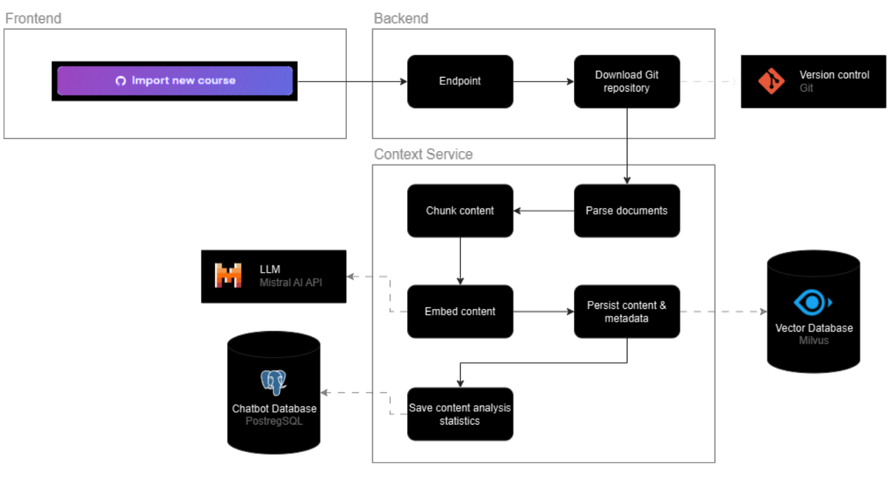

# Context Service

## Table of Contents

- [Context Service](#context-service)
  - [Table of Contents](#table-of-contents)
  - [Overview](#overview)
    - [Create Context](#create-context)
    - [Handles Statistics](#handles-statistics)
  - [How to Run](#how-to-run)
    - [For Production or Non-Context Service Related Development](#for-production-or-non-context-service-related-development)
    - [For Context Service Related Development](#for-context-service-related-development)
      - [Prerequisites](#prerequisites)
      - [Running Context Service Locally](#running-context-service-locally)
    - [Run in Devcontainer](#run-in-devcontainer)
  - [How to Customize the Service](#how-to-customize-the-service)
    - [How to Change Vectorstore](#how-to-change-vectorstore)
    - [How to Change Embedder](#how-to-change-embedder)
    - [How to Add Parsers for Other Extensions](#how-to-add-parsers-for-other-extensions)
    - [How to Change the Textsplitters](#how-to-change-the-textsplitters)
  - [Known Issues](#known-issues)
  - [Future Work](#future-work)

## Overview

The `ContextService` is responsible for loading ACCESS courses from a specified directory each time a request is sent to the `/context/create` endpoint. The service processes each course by performing the following steps:

### Create Context
1. **Load Course Data**: The service reads files specified in the exercise context directory that have supported parsers. Supported file types are listed in `app/model/mappers/reader_mapper.py`.
2. **Parse Content**: It parses the content of the files.
3. **Generate Embeddings**: The service creates embeddings for the parsed content.
4. **Store in Vector Database**: The content is written to a vector database, partitioned by course slug. The hashed course slug is used as the table name in the vector store.



### Handles Statistics
1. **Returns Context Processing Statistics**: The statistics of the extracted files are accessed via the `/context/{course_slug}/status` endpoint

## How to Run

### For Production or Non-Context Service Related Development
- Just run the docker compose of the access infrastructure repository

### For Context Service Related Development

#### Prerequisites
- The services required by the Context Service need to be running. You can run them via the access infrastructure docker compose. The Context Service should not be started with the docker compose.

#### Running Context Service Locally

Follow these steps to set up and run Context Service on your local machine:

1. **Create a Python Virtual Environment**
    ```bash
    python -m venv venv
    ```

2. **Activate the Virtual Environment**
    - On Windows:
        ```bash
        venv\Scripts\activate
        ```
    - On macOS and Linux:
        ```bash
        source venv/bin/activate
        ```

3. **Install Dependencies**
    ```bash
    pip install -r requirements.txt
    ```

4. **Set Environment Variables**

    Ensure the following environment variables are set in your shell or environment configuration:

    ```bash
    WORKDIR_INTERNAL={WORKDIR_INTERNAL}
    MISTRAL_API_KEY={MISTRAL_API_KEY}
    MISTRAL_EMBEDDING_MODEL={MISTRAL_EMBEDDING_MODEL} # should be set to the same embedding model as in the backend, ceteris paribus, mistral-embed
    ```

    ```bash
    CHATBOT_DB_NAME={CHATBOT_DB_NAME} # Default: chatbot
    CHATBOT_DB_USER={CHATBOT_DB_USER} # Default: postgres
    CHATBOT_DB_PASSWORD={CHATBOT_DB_PASSWORD} # Default: postgres
    CHATBOT_DB_HOST={CHATBOT_DB_HOST} # Default: localhost
    CHATBOT_DB_PORT={CHATBOT_DB_PORT} # Default: 5555
    VECTOR_STORE_HOST={VECTOR_STORE_HOST} # Default: 'http://localhost:19530'
    ```

5. **Run the Application**

    Start the application using `uvicorn`:

    ```bash
    uvicorn app.main:app --port 3423 --reload
    ```

### Run in Devcontainer
1. Add this snippet to the `.devcontainer/devcontainer.json`, adjust the `WORKDIR` and the `NETWORK` name. The network name is usually the lowercase directory name where the docker compose is in + `_default` if no custom network was specified.

    ```bash
    "mounts": [
        "source={WORKDIR},target=/usr/data,type=bind,consistency=consistent"
    ],
    "runArgs": [
        "--network={NETWORK}",
        "-p", "3423:3423"
    ]
    ```

2. Reopen in container (VSCODE)
3. Set environment variables
    ```bash
    export MISTRAL_API_KEY={MISTRAL_API_KEY}
    export MISTRAL_EMBEDDING_MODEL={MISTRAL_EMBEDDING_MODEL}
    export VECTOR_STORE_HOST={VECTOR_STORE_HOST}  # Default: 'http://localhost:19530' -> the hostname should be set to service name of vectorstore in network (ceteris paribus, http://milvus-standalone:19530)
    export CHATBOT_DB_NAME={CHATBOT_DB_NAME} # Default: chatbot
    export CHATBOT_DB_HOST={CHATBOT_DB_HOST} # Default: localhost -> should be set to service name of chatbot db in network (ceteris paribus, chatbot_postgres)
    export CHATBOT_DB_USER={CHATBOT_DB_USER} # Default: postgres
    export CHATBOT_DB_PASSWORD={CHATBOT_DB_PASSWORD} # Default: postgres
    export CHATBOT_DB_PORT={CHATBOT_DB_PORT}  # Default: 5555  -> should be set to port of chatbot db in network (ceteris paribus, 5432)
    ```

4. Run fastapi server
    ```bash
    uvicorn app.main:app --host 0.0.0.0 --port 3423 --reload
    ```

## How to Customize the Service

### How to Change Vectorstore

To connect to a different vectorstore, follow these steps:

1. Create a new adapter in `app/model/output_adapter`. The adapter should extend `base_vectorstore` and have the same variables in the constructor as `milvus_vectorstore`.
2. Specify the new adapter in `app/model/mappers/vectorstore_mapper.py`.
3. In `app/config.yaml`, specify which vectorstore to use.

### How to Change Embedder

To connect to a different embedder, follow these steps:

1. Create a new adapter in `app/model/embedder`. The adapter should extend `base_embedder` and have the same variables in the constructor as `mistral_embedder`. It should also return a langchain "Embeddings".
2. Specify the new adapter in `app/model/mappers/embeddings_mapper.py`.
3. In `app/config.yaml`, specify which embedding model to use.

### How to Add Parsers for Other Extensions

To add a parser for other file extensions, follow these steps:

1. Create a new reader in `app/model/data_reader` that extends `BaseReader`. The constructor should take the filepath as an argument.
2. Specify the new reader in `app/model/mappers/reader_mapper.py`.

### How to Change the Textsplitters

- The Textsplitter are different for each file type, therefore you can change them in the data_readers `app/model/data_reader`.

## Known Issues

- Since we want the course to be created without the backend waiting for the context service to finish, the backend returns a successful message immediately after receiving a request, even if the context service encounters an error. This can result in false successful messages.
- When a course is created or updated, the old vectorstore collection is deleted and a new one is created. This is inefficient. The setting `drop_old = True` in `app/model/output_adapter/milvus_store` specifies this behavior. However, the cost for embeddings is low, at $0.1 for 1 million tokens, which is approximately 1500 pages of written text.

## Future Work
- The textsplitters split the text not based on semantics but by a fixed metric like the number of tokens or pages. It would be beneficial if they could split based on the semantics.
